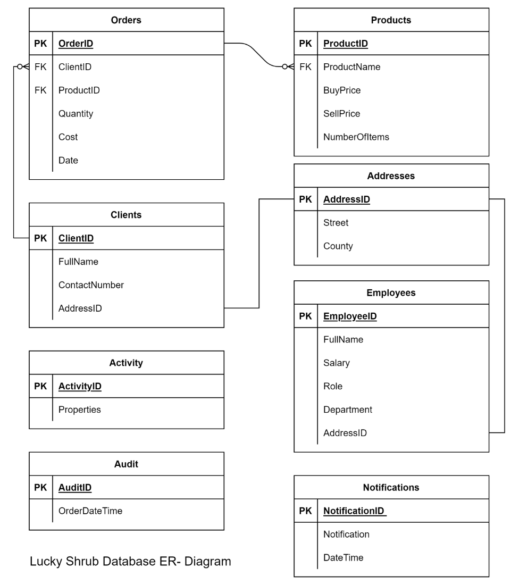
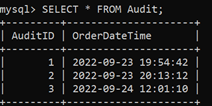
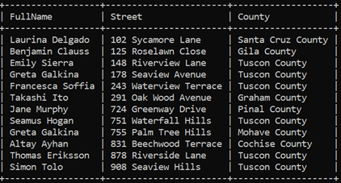
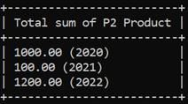
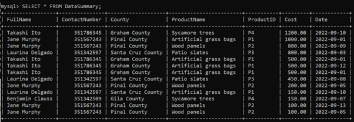

 

## Scenario 

The Lucky Shrub database contains a lot of data about their business. The data is increasing continuously. This database consists of many tables including Clients, Orders, Products, Addresses, Employees, Audit, Notifications and Activity as shown in the following ER-Diagram.  

 


Lucky Shrub want to analyse and summarize their data so that they can evaluate the business’ performance. You can help Lucky Shrub to perform a database analysis by using a range of different optimization methods.

**Note:** Before you begin, make sure you know how to access [MySQL environment](https://www.coursera.org/learn/advanced-mysql-topics/supplement/Xp5Mg/how-to-access-mysql-environment).

## Instructions
To complete this lab, you must have access to the Lucky Shrub database and tables in MySQL. The database’s tables must be populated with the relevant data. Follow these steps to create and populate the database:  


Execute the following code to create the database, tables and insert data:

```SQL 
CREATE DATABASE IF NOT EXISTS Lucky_Shrub; 
 
USE Lucky_Shrub; 
 
CREATE TABLE Clients (ClientID VARCHAR(10) primary key, FullName VARCHAR(100), ContactNumber INT, AddressID INT); 
  
CREATE TABLE Products (ProductID VARCHAR(10) primary key, ProductName VARCHAR(100), BuyPrice DECIMAL(6,2), SellPrice DECIMAL(6,2), NumberOfItems INT);  
  
Create table Addresses(AddressID INT PRIMARY KEY, Street VARCHAR(255), County VARCHAR(100)); 
  
CREATE TABLE Employees (EmployeeID INT primary key, FullName VARCHAR(100), JobTitle VARCHAR(50), Department VARCHAR(200), AddressID INT);  
  
CREATE TABLE Activity( ActivityID INT PRIMARY KEY, Properties JSON ); 
  
CREATE TABLE Audit(AuditID INT AUTO_INCREMENT PRIMARY KEY, OrderDateTime TIMESTAMP NOT NULL  );  
  
CREATE TABLE Orders (OrderID INT NOT NULL PRIMARY KEY,  
ClientID VARCHAR(10), ProductID VARCHAR(10), Quantity INT, Cost DECIMAL(6,2), Date DATE,  
FOREIGN KEY (ClientID) REFERENCES Clients(ClientID), 
FOREIGN KEY (ProductID) REFERENCES Products(ProductID)); 
  
CREATE TABLE Notifications (NotificationID INT AUTO_INCREMENT PRIMARY KEY, Notification VARCHAR(256), DateTime TIMESTAMP NOT NULL); 
 
INSERT INTO Employees (EmployeeID, FullName, JobTitle, Department, AddressID) VALUES    
  
(1, "Seamus Hogan", "Manager", "Management", 7),    
  
(2, "Thomas Eriksson", "Assistant ", "Sales", 8),   
  
(3, "Simon Tolo", "Head Chef", "Management", 9),   
  
(4, "Francesca Soffia", "Assistant  ", "Human Resources", 10),   
  
(5, "Emily Sierra", "Accountant", "Finance", 11),    
  
(6, "Greta Galkina", "Accountant", "Finance", 12);  
  
  
  
INSERT INTO Activity(ActivityID, Properties) VALUES   
  
(1, '{ "ClientID": "Cl1", "ProductID": "P1", "Order": "True" }' ),   
  
(2, '{ "ClientID": "Cl2", "ProductID": "P4", "Order": "False" }' ),   
  
(3, '{ "ClientID": "Cl5", "ProductID": "P5", "Order": "True" }' ); 
  
  
  
INSERT INTO Clients(ClientID, FullName, ContactNumber, AddressID) VALUES   
  
("Cl1", "Takashi Ito", 351786345, 1),   
  
("Cl2", "Jane Murphy", 351567243, 2),   
  
("Cl3", "Laurina Delgado", 351342597, 3),   
  
("Cl4", "Benjamin Clauss", 351342509, 4),   
  
("Cl5", "Altay Ayhan", 351208983, 5),   
  
("Cl6", "Greta Galkina", 351298755, 6);     
  
  
INSERT INTO Products (ProductID, ProductName, BuyPrice, SellPrice, NumberOfITems) VALUES   
  
("P1", "Artificial grass bags ", 40, 50, 100),   
  
("P2", "Wood panels", 15, 20, 250),   
  
("P3", "Patio slates", 35, 40, 60),   
  
("P4", "Sycamore trees ", 7, 10, 50),   
  
("P5", "Trees and Shrubs", 35, 50, 75),   
  
("P6", "Water fountain", 65, 80, 15); 
  
  
  
INSERT INTO Addresses(AddressID, Street, County) VALUES   
  
(1, ",291 Oak Wood Avenue", "Graham County"),   
  
(2, "724 Greenway Drive", "Pinal County"),   
  
(3, "102 Sycamore Lane", "Santa Cruz County"),   
  
(4, "125 Roselawn Close", "Gila County"),   
  
(5, "831 Beechwood Terrace", "Cochise County"),  
  
(6, "755 Palm Tree Hills", "Mohave County"),   
  
(7, "751 Waterfall Hills", "Tuscon County") ,   
  
(8, "878 Riverside Lane", "Tuscon County") ,   
  
(9, "908 Seaview Hills", "Tuscon County"),   
  
(10, "243 Waterview Terrace", "Tuscon County"),   
  
(11, "148 Riverview Lane", "Tuscon County"),    
  
(12, "178 Seaview Avenue", "Tuscon County");  
  
  
INSERT INTO Orders (OrderID, ClientID, ProductID , Quantity, Cost, Date) VALUES   
  
(1, "Cl1", "P1", 10, 500, "2020-09-01" ),   
  
(2, "Cl2", "P2", 5, 100, "2020-09-05"),   
  
(3, "Cl3", "P3", 20, 800, "2020-09-03"),   
  
(4, "Cl4", "P4", 15, 150, "2020-09-07"),   
  
(5, "Cl3", "P3", 10, 450, "2020-09-08"),   
  
(6, "Cl2", "P2", 5, 800, "2020-09-09"),   
  
(7, "Cl1", "P4", 22, 1200, "2020-09-10"),   
  
(8, "Cl3", "P1", 15, 150, "2020-09-10"),   
  
(9, "Cl1", "P1", 10, 500, "2020-09-12"),   
  
(10, "Cl2", "P2", 5, 100, "2020-09-13"),   
  
(11, "Cl4", "P5", 5, 100, "2020-09-15"),  
  
(12, "Cl1", "P1", 10, 500, "2022-09-01" ),   
  
(13, "Cl2", "P2", 5, 100, "2022-09-05"),   
  
(14, "Cl3", "P3", 20, 800, "2022-09-03"),   
  
(15, "Cl4", "P4", 15, 150, "2022-09-07"),   
  
(16, "Cl3", "P3", 10, 450, "2022-09-08"),   
  
(17, "Cl2", "P2", 5, 800, "2022-09-09"),   
  
(18, "Cl1", "P4", 22, 1200, "2022-09-10"),   
  
(19, "Cl3", "P1", 15, 150, "2022-09-10"),   
  
(20, "Cl1", "P1", 10, 500, "2022-09-12"),   
  
(21, "Cl2", "P2", 5, 100, "2022-09-13"),    
  
(22, "Cl2", "P1", 10, 500, "2021-09-01" ),   
  
(23, "Cl2", "P2", 5, 100, "2021-09-05"),   
  
(24, "Cl3", "P3", 20, 800, "2021-09-03"),   
  
(25, "Cl4", "P4", 15, 150, "2021-09-07"),   
  
(26, "Cl1", "P3", 10, 450, "2021-09-08"),   
  
(27, "Cl2", "P1", 20, 1000, "2022-09-01" ),   
  
(28, "Cl2", "P2", 10, 200, "2022-09-05"),   
  
(29, "Cl3", "P3", 20, 800, "2021-09-03"),   
  
(30, "Cl1", "P1", 10, 500, "2022-09-01" ); 

```

## Tasks

### **Task 1:**
Lucky Shrub need to find out what their average sale price, or cost was for a product in 2022.

You can help them with this task by creating a “FindAverageCost” function that returns the average sale price value of all products in a specific year. This should be based on the user input. 

The screenshot below shows the average cost returned from the FindAverageCost function based on the user input of the year 2022:


### **Task 2:**

Lucky Shrub need to evaluate the sales patterns for bags of artificial grass over the last three years. Help them out using the following steps:

1.Create the “EvaluateProduct” stored procedure that outputs the total number of items sold during the last three years for the P1 Product ID. Input the ProductID when invoking the procedure.

2.Call the procedure.

3.Output the values into outside variables. 

The screenshot below shows the total number of items sold during the last three years of the ‘P1’  ProductID.


### **Task 3:**

Lucky Shrub need to automate the orders process in their database. The database must insert a new record of data in response to the insertion of a new order in the Orders table. This new record of data must contain a new ID and the current date and time.

You can help Lucky Shrub by creating a trigger called “UpdateAudit”. This trigger must be invoked automatically AFTER a new order is inserted into the Orders table.

Remember: The AuditID is an auto increment key. Therefore, you don’t need to insert it manually.

For example, when you insert three new orders in the Orders table, then three records of data are automatically inserted into the Audit table. This is shown in the following screenshot: 



## **Task 4:**

Lucky Shrub need location data for their clients and employees. To help them out, create an optimized query that outputs the following data:

•	The full name of all clients and employees from the Clients and Employees tables in the Lucky Shrub database. 

•	The address of each person from the Addresses table. 

The data should be ordered by the street name. The output result is shown in the following screenshot: 




## **Task 5:** 

Lucky Shrub need to find out what quantities of wood panels they are selling. The wood panels product has a Product ID of P2. The following query returns the total quantity of this product as sold in the years 2020, 2021 and 2022:

```SQL 
SELECT CONCAT (SUM(Cost), " (2020)") AS "Total sum of P2 Product" FROM Orders WHERE YEAR (Date) = 2020 AND ProductID = "P2" 
UNION 
SELECT CONCAT (SUM(Cost), "(2021)") FROM Orders WHERE YEAR (Date) = 2021 AND ProductID = "P2" 
UNION 
SELECT CONCAT (SUM (Cost), "(2022)") FROM Orders WHERE YEAR (Date) = 2022 AND ProductID = "P2";
```

The output of this query is shown in the following screenshot: 



Your task is to optimize this query by recreating it as a common table expression (CTE).


## **Task 6:** 
Lucky Shrub want to know more about the activities of the clients who use their online store. The system logs the ClientID and the ProductID information for each activity in a JSON Properties column inside the Activity table. This occurs while clients browse through Lucky Shrub products online. The following screenshot shows the Activity table.


  
Utilize the Properties data to output the following information:

•	The full name and contact number of each client from the Clients table. 

•	The ProductID for all clients who performed activities.  

#### Tip:
 
 Use the following code to access the property value with double quotations from the JSON datatype:
->'$.PropertyName 

Use the following code to access the property value without double quotations from the JSON datatype:
 ->>'$. PropertyName 

The output result of this query is shown in the screenshot below. 
 


## **Task 7:** 

Lucky Shrub need to find out how much revenue their top selling product generated. Create a stored procedure called “GetProfit” that returns the overall profits generated by a specific product in a specific year. This should be based on the user input of the ProductID and Year.
For example, the output result of” GetProfit” procedure with the P1 ProductID and Year 2020 is displayed in the screenshot below.  


The following code creates a procedure “GetProfile”, which accepts two input parameters a product id and a year. These will be passed to the procedure to return the overall profits generated by the specified product and in the specific year. 

The code declares relevant variables to store required data extracted from the tables using the relevant SELECT statements.  
Next, it calculates the profit using a suitable logic in SET profit = (logic). Finally, it outputs the result using SELECT profit statement.
You can use the following code to complete this task. Make sure that you input the relevant parameters and values.

```SQL 
DELIMITER //
```

```SQL 
CREATE PROCEDURE GetProfit (IN product_id VARCHAR(10), IN YearInput INT)  
BEGIN   

DECLARE profit DEC(7,2) DEFAULT 0.0;
DECLARE sold_quantity, buy_price, sell_price INT DEFAULT 0;

SELECT  SUM(Quantity) INTO sold_quantity FROM Orders WHERE ProductID = product_id AND YEAR(Date) = YearInput;
SELECT  BuyPrice INTO buy_price FROM Products WHERE ProductID = product_id;
SELECT  SellPrice INTO sell_price FROM Products WHERE ProductID = product_id;  

SET profit = (sell_price * sold_quantity) - (buy_price * sold_quantity);

SELECT profit;
END //

DELIMITER ;
```

## **Task 8:**
Lucky Shrub need a summary of their client’s details, including their addresses, order details and the products they purchased. Help them out by creating a virtual table called ‘DataSummary’ that joins together the four tables that contain this data. These four tables are as follows:

•	Clients, 

•	Addresses, 

•	Orders,

•	and Products. 

The virtual table must display the following data:

•	The full name and contact number for each client from the Clients table.

•	The county that each client lives in from the Addresses table.

•	The name of the product they purchased from the Products table. 

•	The ProductID, cost and date of each order from the Orders table. 

The virtual table should show relevant data for year 2022 only. Order the data by the cost of the highest order. An example is shown in the following screenshot: 




